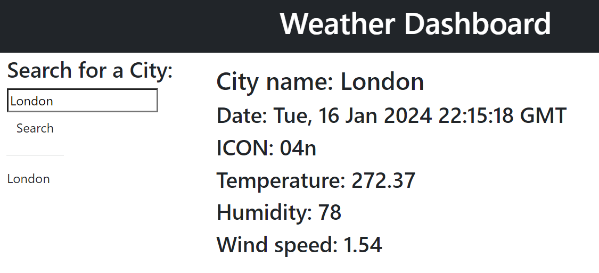

# Weather-Dashboard-Kelly-Bearne
A weather dashboard with form inputs, which utilises OpenWeather API to retrieve weather data

## Description

This project fullfils the criteria of building a browser application that allows users to view current and future weather for a chosen city (which they search for).

## Installation

N/A

## Usage

Access the deployed application at the following URL: https://kbearne.github.io/Weather-Dashboard-Kelly-Bearne

This application runs in the browser and allows a user to search for current and future weather for a chosen city.

The application displays the current date and time by utilising day.js library.

## Built with

  

## License

MIT license